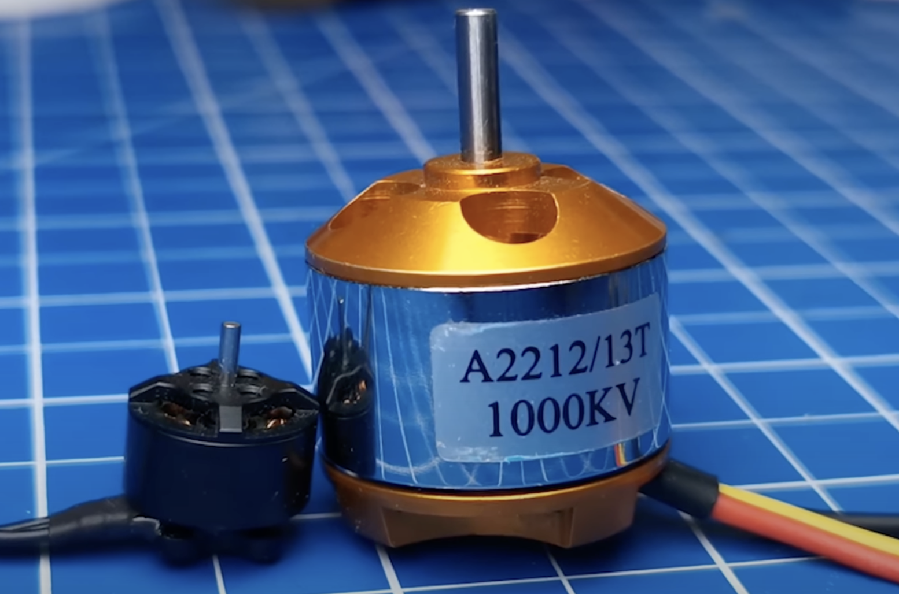

---

title: "FOC算法、电机控制及相关开源项目学习笔记"

published : false

---

# FOC（Field-Oriented Control）算法学习笔记

本文档总结了我在 FOC 电机控制领域的学习过程，包括理论知识、开源项目参考、控制算法、实战经验及相关概念。适合在求职中展示专业能力，也方便自我复习和深入研究。

---

## 1. 电机控制基础

### 1.1 电调（ESC, Electronic Speed Controller）

Electronic Speed Controller（电子速度控制器，简称 ESC）是用于控制电机速度和转向的电子装置。它广泛应用于无人机、机器人、工业自动化及其他电机驱动场景。

- **作用**：
  - 将控制信号（PWM/DShot）转化为电机驱动电流
  - 提供过流、过压、过温保护
  - 实现高效的电机调速与制动

- **典型应用**：
  - 无人机飞控系统
  - 电动滑板、电动自行车
  - 工业机器人关节驱动

### 1.2 电机类型

1. **直流有刷电机（Brushed DC Motor）**
   - 结构简单，控制容易
   - 低成本，但寿命短，需要维护

2. **无刷直流电机（BLDC, Brushless DC Motor）**
   - 无刷设计，寿命长
   - 高效率、高功率密度
   - 常用于无人机、电动车和机器人

3. **步进电机（Stepper Motor）**
   - 精确定位，常用于打印机、CNC 等
   - 控制信号复杂，速度限制较多

---

## 2. 控制算法基础

### 2.1 PID 控制

PID（Proportional–Integral–Derivative）是一种经典控制算法，常用于电机转速、位置及电流闭环控制。

- **公式**：
  \[
  u(t) = K_p e(t) + K_i \int e(t) dt + K_d \frac{de(t)}{dt}
  \]
- **应用**：
  - 电机速度控制
  - 位置控制
  - 温度控制、工业过程控制

### 2.2 LQR 控制

LQR（Linear Quadratic Regulator）是一种优化型控制算法，用于多变量系统的最优控制。

- **特点**：
  - 通过求解 Riccati 方程得到最优反馈增益
  - 可以处理多输入多输出（MIMO）系统
- **应用**：
  - 航空航天控制
  - 机器人关节控制
  - 高性能电机控制

### 2.3 FOC（磁场定向控制）

FOC 是针对三相无刷电机的一种高性能控制方法，将三相电机的电流分解为磁场方向的两个正交分量，实现转矩和磁通的解耦控制。

- **核心思想**：
  1. 将三相电流通过 Clarke 和 Park 变换转化为 d-q 坐标系
  2. 分别控制 d（磁通方向）和 q（转矩方向）电流
  3. 通过逆变换得到 PWM 驱动信号
- **优点**：
  - 高动态响应
  - 平稳的转矩输出
  - 提高电机效率和精度

---

## 3. PWM 与 DShot 控制

### 3.1 PWM（脉冲宽度调制）

- **概念**：
  - PWM（Pulse Width Modulation）是一种通过调节脉冲宽度来控制平均电压的方法。
- **历史**：
  - 起源于 20 世纪 30–40 年代
  - 随晶体管和 MOSFET 出现而广泛应用

### 3.2 DShot（Digital Shot）

- **概念**：
  - 数字电调控制协议，替代传统 PWM
  - 支持高速、高精度的电机控制
- **优点**：
  - 精度高、稳定性强
  - 传输速度快
  - 自带 CRC 校验，减少错误

---

## 4. 开源项目参考

### 4.1 Simple FOC

- 一个开源电机控制库，支持 Arduino、STM32 等平台
- 特点：
  - 支持 BLDC 和步进电机
  - 提供 PID 和电流闭环控制示例
  - 代码清晰，适合学习和二次开发

### 4.2 其他开源资源

- **BLHeli_32**：针对无人机 ESC 的开源固件
- **VESC**：高性能电机控制器，支持 FOC
- **PX4/Ardupilot**：无人机飞控系统，内置 FOC 控制模块

---

## 5. 实战经验与调试技巧

1. **硬件调试**：
   - 使用示波器观察电机相电流波形
   - 检查 Hall 传感器信号和相序
2. **软件调试**：
   - 使用仿真工具（Matlab/Simulink）验证控制算法
   - 使用日志和实时图表监控 d-q 电流、转速和转矩
3. **性能优化**：
   - 合理选择 PWM 频率
   - 优化 PID 参数
   - 使用高精度电流传感器减少噪声

---

## 6. 学习路线建议

1. **理论基础**：
   - 电机学、电力电子学、控制理论
2. **算法实践**：
   - PID、LQR、FOC 实现
3. **项目实践**：
   - Arduino/STM32 电机控制实验
   - 开源 ESC 固件二次开发
4. **高级优化**：
   - 电机建模与仿真
   - 最优控制与自适应控制
   - 机器学习优化电机控制参数

---

## 7. 总结

FOC 是高性能电机控制的核心技术，通过理论学习、开源项目实践和硬件调试，可以快速掌握现代电机控制的核心技能。掌握 PID、LQR、PWM、DShot 等知识可以让你在无人机、机器人及工业自动化领域显示专业能力。

---

## 参考资料

1. [Simple FOC 官方文档](https://simplefoc.com/)
2. [VESC 开源项目](https://vesc-project.com/)
3. 《现代电机控制技术》，John G. Kassakian
4. 《Control Systems Engineering》，Norman S. Nise

#### DRV8353 

##### 1. Definition

- The **DRV8353** is a **three-phase gate driver IC** from Texas Instruments.  
- It is designed to drive external MOSFETs in **Brushless DC (BLDC)** and **Permanent Magnet Synchronous Motors (PMSM)**.  
- Works with up to 100 V supply systems.  

##### 2. Key Features

- 3-phase MOSFET gate driver (for 6 MOSFET half-bridges).  
- Integrated current shunt amplifiers for motor phase current sensing.  
- Supports 6-step (trapezoidal) or field-oriented control (FOC).  
- Protection functions: overcurrent, undervoltage, thermal shutdown, fault reporting.  
- SPI or hardware interface depending on variant (DRV8353, DRV8353S, DRV8353R).  

### references and resources

#### [simple foc clone](https://oshwhub.com/zjsxzc217/simplefoc_-tai-gong-shuai-shuang-tong-dao). 

This edition is poor rated, be careful.

INA240, A current sense amplifier from Texas Instruments (TI). 

The SN74HC244DWR is an **8-bit buffer/line driver IC with tri-state outputs**, used to drive or isolate data buses in digital systems.  

[odrive](https://github.com/odriverobotics/ODrive). Very good and offical.

## talking about products

Drone. Before 2016, Dji has its famous phantom series. Later Yumian Deng design a foldable drone.

What is interesting, before Deng's drone, there have been affoable foldable drones but with low perfomance. 

## talking about drone stucture

The design where the front and rear propellers are not in the same plane places high demands on the flight controller.

### example of foc real products

This photo is from Unitree go2.

{: .align-center}

By the way, you can look at this hall sensor.

{: .align-center}

Coreless_motor also as below.

{: .align-center}coreless_motor

## Clarke and Park Transforms — Key Papers

## Foundational / Survey Papers

| Title | Authors / Source | Year | Key Contributions |
|---|---|---|---|
| “Formulating the geometric foundation of Clarke, Park, and FBD transformations” | — (Wiley) | ~3–4 years ago | 探讨如何通过对电压／电流向量强加正交性来导出 Clarke、Park、FBD 变换。 [oai_citation:0‡Wiley Online Library](https://onlinelibrary.wiley.com/doi/full/10.1002/mma.8038?utm_source=chatgpt.com) |
| “Signal Processing Perspective of the Clarke and Related Transforms” | — (ArXiv) | 2018 | 从数据分析（PCA等）角度看三相信号，以及 Clarke / Park 变换如何减少维度 / 去冗余。 [oai_citation:1‡arXiv](https://arxiv.org/pdf/1807.08720?utm_source=chatgpt.com) |
| “Modified park transformation of three-phase signals for harmonic …” | — (ScienceDirect) | 最近 | 对 Park 变换中的角度计算做修改以改善处理含谐波信号的效果。 [oai_citation:2‡ScienceDirect](https://www.sciencedirect.com/science/article/pii/S0142061523001266?utm_source=chatgpt.com) |
| “Park and Clark Transformations: A Short Review” | Ali Abdul Razzaq Altahir | ~2020 | 简要回顾 Clarke 和 Park 变换的定义、数学性质和在电机控制中的应用。 [oai_citation:3‡ResearchGate](https://www.researchgate.net/publication/340681625_Park_and_Clark_Transformations_Park_and_Clark_Transformations_A_Short_Review?utm_source=chatgpt.com) |

## Application / Implementation Papers

| Title | Authors / Source | Year | Context / Application |
|---|---|---|---|
| “CLARKE & PARK TRANSFORMS ON THE TMS320C2xx” | Texas Instruments Application Note | — | 在 DSP（TMS320C2xx）上实现 Clarke 和 Park 变换的细节，包括逆变器驱动中的用法。 [oai_citation:4‡Texas Instruments](https://www.ti.com/lit/an/bpra048/bpra048.pdf?utm_source=chatgpt.com) |
| “Adoption of Park’s Transformation for Inverter Fed Drive” | Jayarama Pradeep, R. Devanathan | 2015 | 在逆变器供电驱动中用 Park 变换来得到 dq 分量，简化计算复杂度。 [oai_citation:5‡ResearchGate](https://www.researchgate.net/publication/282207368_Adoption_of_Park%27s_Transformation_for_Inverter_Fed_Drive?utm_source=chatgpt.com) |
| “A Clarke Transformation-based DFT Phasor and Frequency …” | — (OSTI) | — | 将 Clarke 变换与 DFT（离散傅里叶变换）结合，用于频谱／相量分析。 [oai_citation:6‡OSTI](https://www.osti.gov/servlets/purl/1474555?utm_source=chatgpt.com) |

## New / Geometric / Robotics Extensions

| Title | Authors | Year | Novel Aspect |
|---|---|---|---|
| “The Frenet Frame as a Generalization of the Park Transform” | Federico Milano | 2022 | 用微分几何（Frenet frame）扩展 Park 变换，对三相电路和更多相数情况做推广。 [oai_citation:7‡arXiv](https://arxiv.org/abs/2206.09209?utm_source=chatgpt.com) |

---

### Synthesize a sine wave from square waves

Modern ESCs implement **Space Vector PWM (SVPWM)**, which can be seen as an advanced way of using square waves (switching signals) to approximate a sinusoidal waveform.

### n52 grade magnets 

### case of simple esc & brushless motor

{: .align-center}

this motor at right is a typical brushless motor.

talking about brushless motor, we must talk about esc too.

Personallly I dont know the principle of a esc.

Especially the three small lines.

