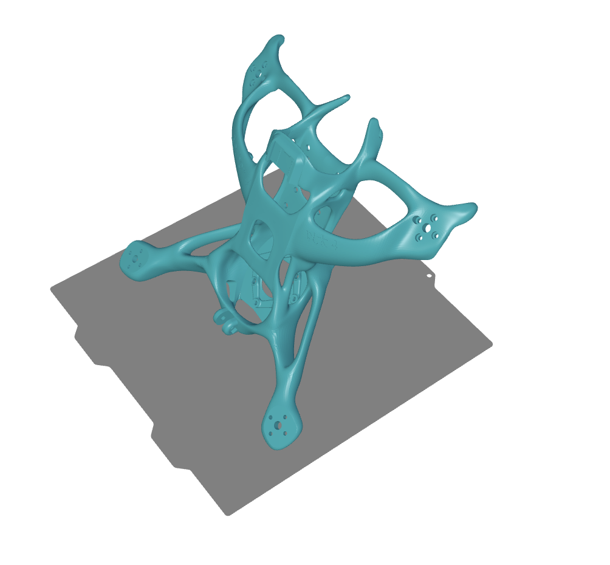

---

title : "Aether, a brain-new design for quadcopter"

published : false

---

### main line

[Pavo20 Brushless Whoop Frame](https://betafpv.com/collections/brushless-frame/products/pavo20-brushless-whoop-frame?variant=40240553558150). This one is a case for embedding Dji O3 VTX and small cam.

Dovetail groove, it can hold gps or GoPro three-prong mount.

Traditional carbon fiber frames usually make it difficult to keep the propellers out of sight, since the camera and propellers are positioned at the same height. However, with 3D modeling, this issue can be completely avoided. The Aether 4 lowers the propellers while raising the camera position, making it easy to keep the propellers out of the camera’s field of view. This gives the drone a regular “X” structure, which provides better flight performance compared to DC or other configurations.

{: .align-center}.

But, I still don't know how the auther design this biomimetic structure using OnShape website.

### openfoam by the way 

OpenFOAM is officially provided mainly for **Linux distributions** (Ubuntu, Debian, CentOS, etc.).  

I wonder if I can simulate air flow to design a drone frame.

