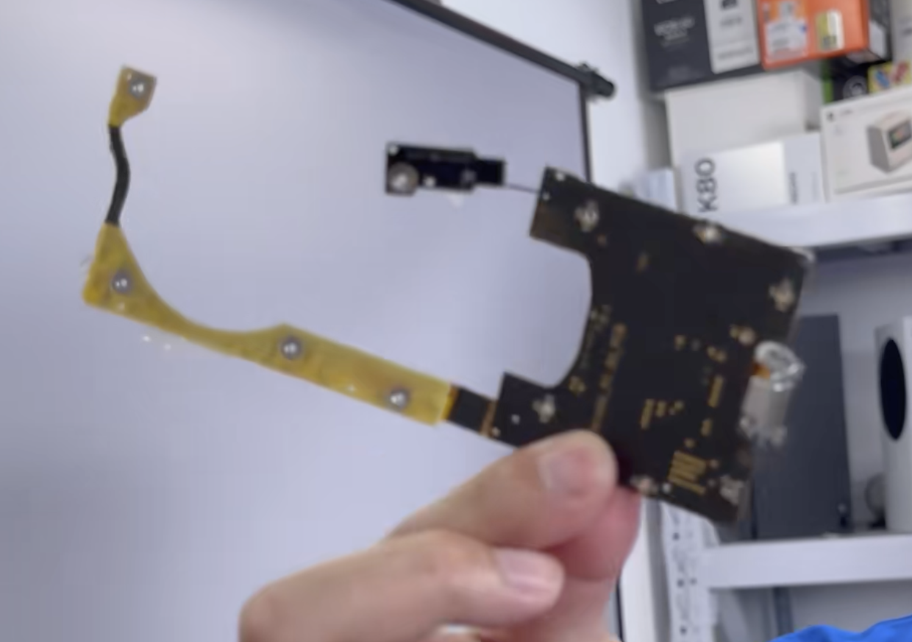
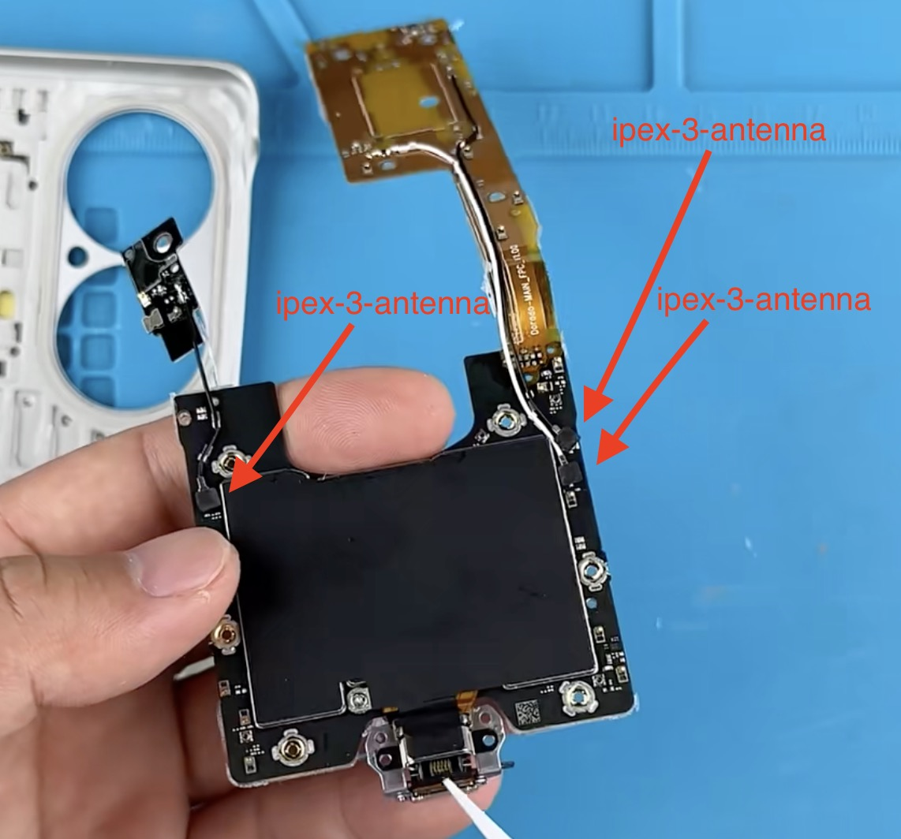

---

title : "Make a cpe from udx710"

published : false

---

Unpack the original shell.

{: .align-center}

Now we got this.

{: .align-center}

And these three are antennas.

{: .align-cneter}

